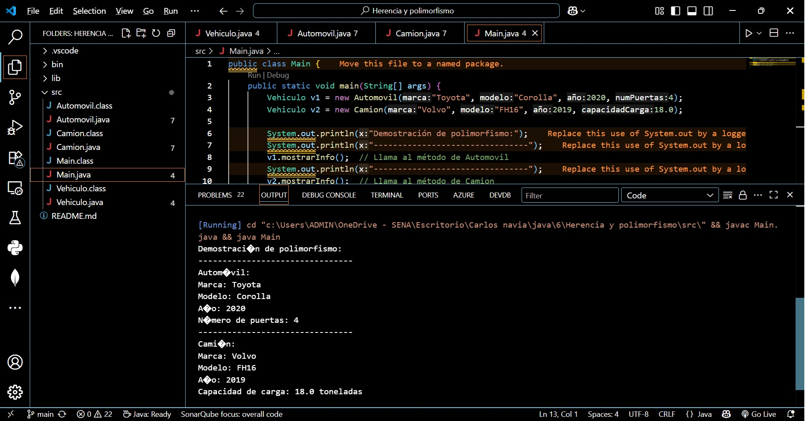

# project-java-herencia

Este proyecto demuestra el uso de herencia y polimorfismo en Java mediante una jerarquía de clases relacionadas con vehículos.

Jerarquía de clases:

Vehiculo (abstracta)
 ├── Automovil
 └── Camion

- Vehiculo: clase base abstracta con atributos comunes (marca, modelo, año) y método abstracto mostrarInfo().
- Automovil: hereda de Vehiculo, añade numPuertas y sobrescribe mostrarInfo().
- Camion: hereda de Vehiculo, añade capacidadCarga y sobrescribe mostrarInfo().

Demostración en consola:

Se utiliza polimorfismo al declarar objetos de tipo Vehiculo, instanciados como Automovil y Camion.

Ejemplo de salida:

Demostración de polimorfismo:
--------------------------------
Automóvil:
Marca: Toyota
Modelo: Corolla
Año: 2020
Número de puertas: 4
--------------------------------
Camión:
Marca: Volvo
Modelo: FH16
Año: 2019
Capacidad de carga: 18.0 toneladas

Captura de pantalla:

